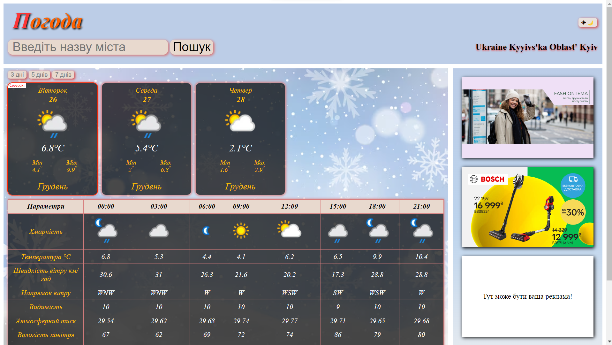
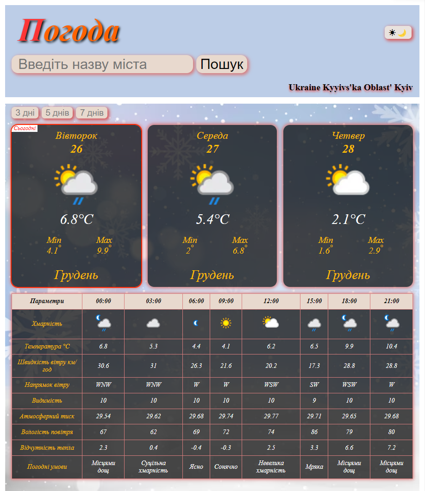
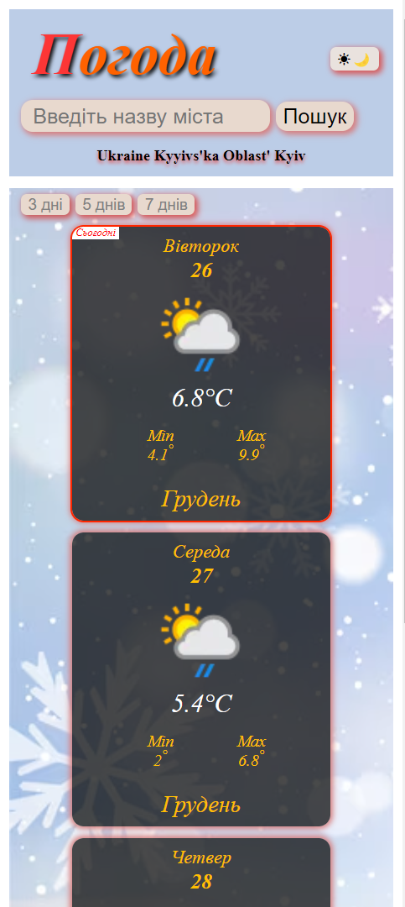
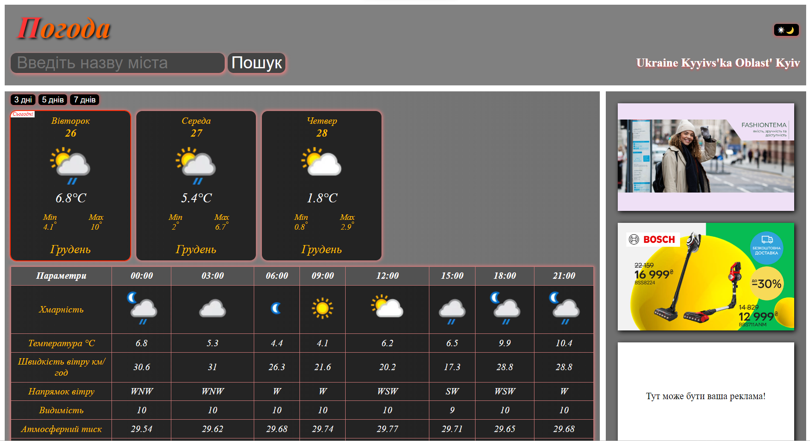
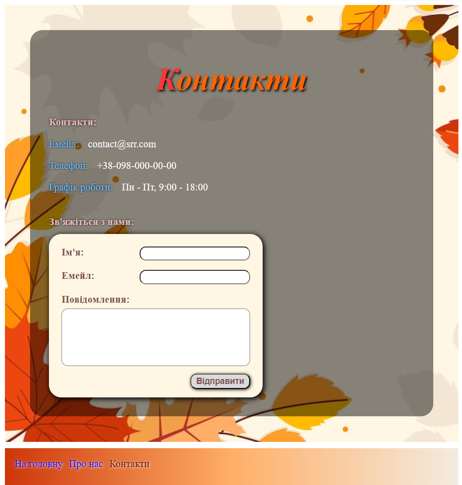
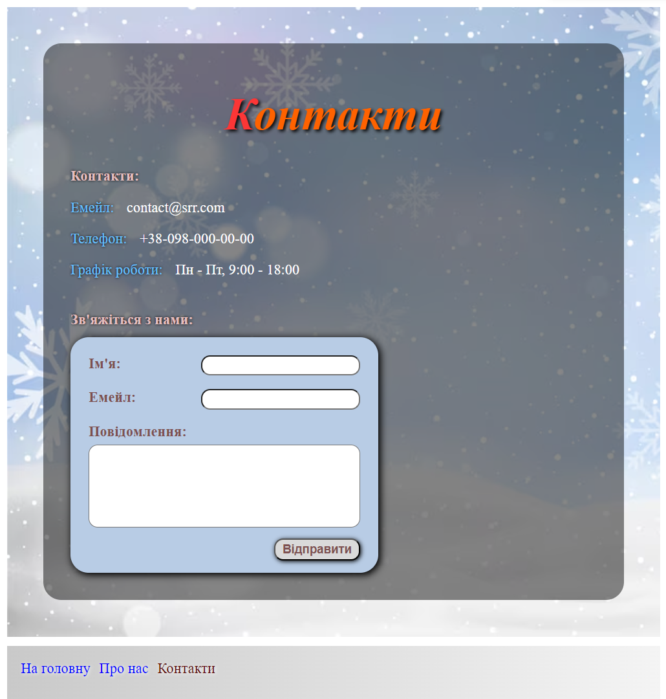
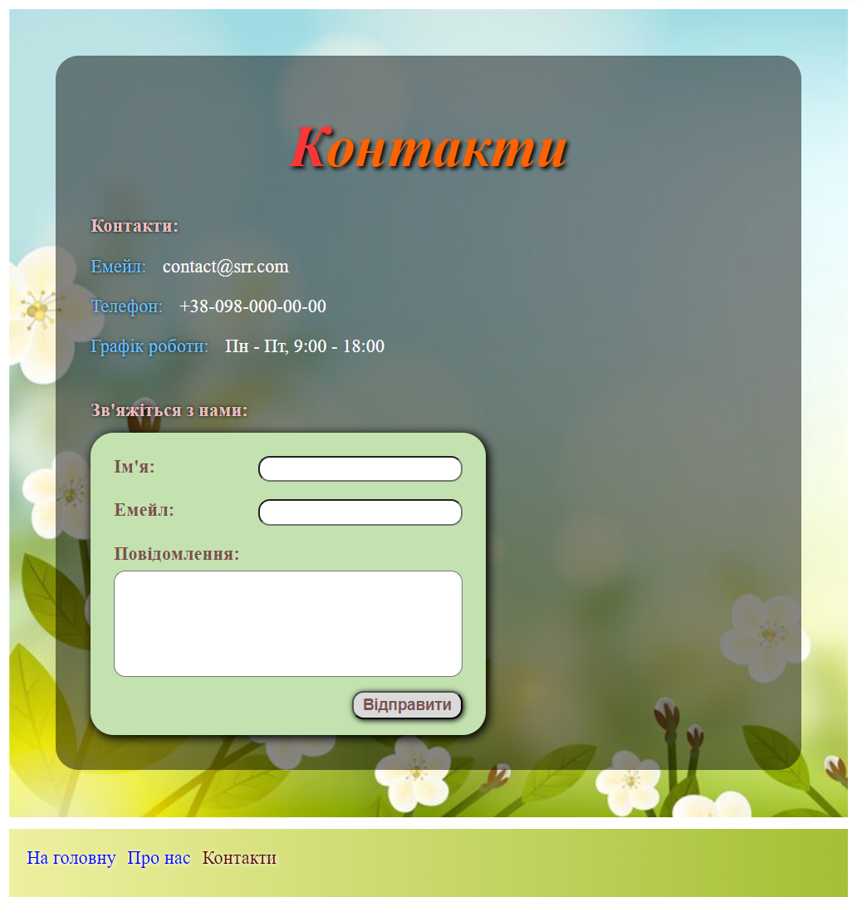
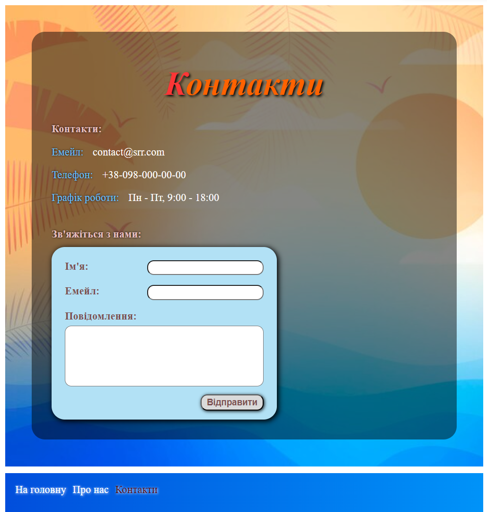

# Weather
>Hello, my name is **Sergey**!
 This web application is an interactive tool for viewing the weather in different regions of the world. It is developed using the **React** library and the **Vite** development tool to create a user interface and navigate between pages using **React Router**.

# Basic functions
* **Weather information**: The application provides the ability to view the current weather, forecast for the next few days, temperature, humidity and other weather parameters for selected locations.
* **Dynamic themes**: This app has 4 themes that automatically change depending on the season, as well as a dark mode for comfortable use at night or in low light conditions.
* **Language extension**: The api provides the ability to search in different languages.(unfortunately, except for Ukrainian)
* **Convenient interface in Ukrainian**: Optimized for the Ukrainian audience will make use more comfortable.

### Tech stack
* [X] **React**: *JavaScript-library* for building user interfaces.
* [X] **Vite**: Fast and advanced web application development tool.
* [X] **React Router**: Library for navigating and managing pages in *React* applications.
* [X] **Weather API**: Using an external *API* to get up-to-date weather information.
___
[Link to the site with the *weather*](https://rss-777.github.io/weather-project/)

___
### Screenshot

    
     
    

 

    

 

    
    
    
    

